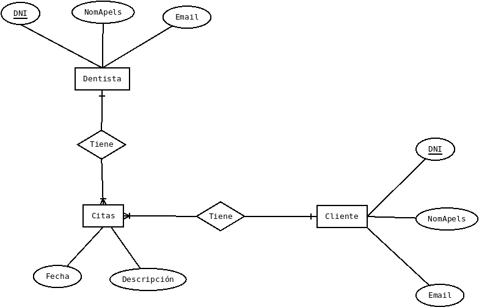

# EX02
API Clinica dental

## Cliente
GET
  * /api/cliente (Visualizar todos los clientes)
  * /cliente/{id} (Visualizar datos de usuario: Req. 1)
  
PUT
  * /api/cliente/{id} (Modificacion datos de usuario: Req. 2)
  
  
## Dentista
GET
  * /api/dentista/clientes (Visualizar todos los clientes registrados: Req. 8)
  * /api/dentista/citas (Visualizar todas las citas: Req. 7)
  * /api/dentista/{id} (Visualizar dentista)
  
POST
  * /api/dentista (Crear dentista)
  
PUT
  * /api/dentista/{id} (Actualizar datos dentista)

DELETE
  * /api/dentista/{id} (Borrar dentista)
  
## Cita
GET
  * /api/cita (Visualizar citas)
  * /api/cita/{id} (Visualizar cita)
  * /api/cita/cliente/{id} (Visualizar citas de un determinado usuario: Req. 6)

POST
  * /api/cita (Creación de cita: Requerimiento 3)
  
PUT
  * /api/cita/{id} (Modificacion de cita: Requerimiento 4)

DELETE
  * /api/cita/{id} (Requerimiento 5)

## Diagrama ER

## Ejemplos curl

  * GET cita 3

        curl -H "Content-type: application/json" -X GET localhost:8181/api/citas/3 | jq
        	
        	{
        	"id": 3,
        	"descripcion": "Revisión",

            "fecha": "2023-04-20T10:30:00",
              "cliente": {
                "dni": "23458690",
                "nomapels": "Carlos Montes",
                "email": "cmontes@gmail.com"
              },
              "dentista": {
                "dni": "77758697",
                "nomapels": "Carbon el Borracho",
                "email": "cborrachodental.com"
              }
            }

  * PUT de un cliente

        curl -H "Content-type: application/json" -X PUT -d '{"nomapels": "reverendo joe"}' localhost:8181/api/cliente/23458690 | jq
          
          {
          "dni": "23458690",
          "nomapels": "reverendo joe",
          "email": null
        }

  * PUT de una cita
  
		curl -H "Content-type: application/json" -X PUT -d '{"descripcion": "Dolor agudo", "fecha": "2023-04-20T10:30:00", "cliente": {"dni": "23458690"}, "dentista": {"dni": "77758697"}}' localhost:8181/api/citas/3 | jq
		
		{

        "id": 3,
          "descripcion": "Dolor agudo",
          "fecha": "2023-04-20T10:30:00",
          "cliente": {
            "dni": "23458690",
            "nomapels": null,
            "email": null
          },
          "dentista": {
            "dni": "77758697",
            "nomapels": null,
            "email": null
          }
        }
